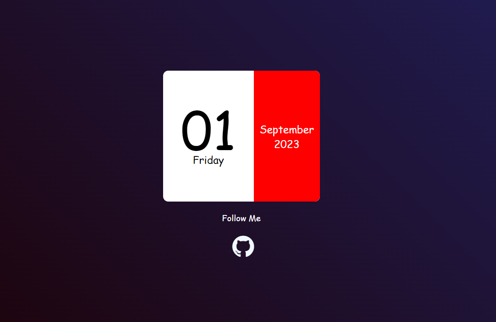

# Calendar Web App

This is a simple web application that displays a calendar on a webpage. The calendar shows the current date, day, month, and year. Additionally, it provides a link to the author's GitHub profile.

## Preview


## Features

- Displays the current date and day of the week.
- Shows the current month and year.
- Provides a link to the author's GitHub profile.

## Usage

1. Clone the repository:

   ```
   git clone https://github.com/suvendhu128/calendar.git
   ```

2. Open the `index.html` file in a web browser.

## Dependencies

- [index.html](index.html) - Html file
- [style.css](style.css) - Custom stylesheet for styling the calendar layout.
- [script.js](script.js) - JavaScript file containing logic for displaying date information.

## Credits

- Author: [Suvendhu PATEL](https://github.com/suvendhu128)


Feel free to contribute, open issues, and provide feedback!